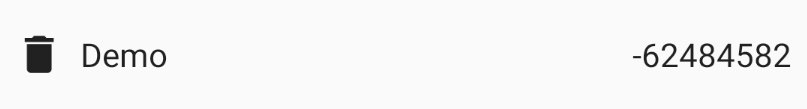

# Expérimentation avec la recomposition

En partant d'une idée à la con : `val random = remember { Random.nextInt() }`, essayer de comprendre
comment la recomposition et les remember fonctionnent.

Réponse dans [Positional Memoization in Jetpack de Jorge Castillo](https://effectiveandroid.substack.com/p/positional-memoization-in-jetpack)
et [Under the hood of Jetpack Compose — part 2 of 2 de Leland Richardson](https://medium.com/androiddevelopers/under-the-hood-of-jetpack-compose-part-2-of-2-37b2c20c6cdd)

J'ai donc créé un composant qui utilise ce `remember` insensé



```kotlin
@Composable
fun Item(item: Value, onRemoveClick: (Value) -> Unit) {
    val random = remember { Random.nextInt() }
    Row(
        Modifier.padding(8.dp),
        verticalAlignment = Alignment.CenterVertically
    ) {
        Icon(
            painter = rememberVectorPainter(Icons.Default.Delete),
            contentDescription = "Delete $item",
            modifier = Modifier.clickable { onRemoveClick(item) }
        )
        Text(item.text, Modifier.padding(8.dp))
        Text(random.toString(), textAlign = TextAlign.End, modifier = Modifier.weight(1f))
    }
}
```

Puis je l'ai utilisé de 3 façons différentes :
- Dans une `Column` sans rien faire de particulier
- Dans une `Column` en encapuslant l'`Item` dans un `key(id) { ... }`
- Dans une `LazyColmun` en utilisant le concept de `key`

Le résultat est marrant pour la première idée, on comprend que la position des Composable dans
l'arbre des Composable est hyper importante pour définir une `key` par défaut. Mais la position
n'est plus utilisée quand on vient spécifier explicitement la `key`.
